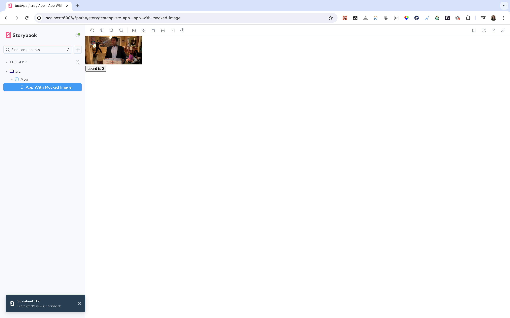

# msw-cypress-docker-storybook

Reproduction repository to debug MSW in "fallback mode" when running Cypress in a docker image against a locally running Storybook instance.

## Screenshots

Story in Storybook locally:

Screenshot generated by Cypress screenshot plugin in Docker against Storybook:

Screenshot of Storybook from within the Cypress Docker container:

## Reproduction steps

- Run `yarn storybook` from the root of the repo to view a locally running instance of Storybook and confirm the image is being mocked correctly.
- Run `yarn test:visual` to confirm that the snapshot generated by Cypress against Storybook isn't mocking the image correctly.

To view how the story is being rendered in the Docker container, you need to do some setup steps:

- From https://sourabhbajaj.com/blog/2017/02/07/gui-applications-docker-mac/?ref=cypress-io.ghost.io - run `brew install xquartz` from your terminal and restart your machine
- Run `open -a XQuartz` from your terminal
- Go to XQuartz settings as per the instructions in that link and update the security checkbox "Allow connections from network clients"
- Set the IP environment variable as per the instructions in that link: `IP=$(ipconfig getifaddr en0)` and
`/usr/X11/bin/xhost + $IP`
- Run `IP=$IP yarn test:visual` to see the test runner open up, and run `debugStorybook` test file to inspect the Storybook entry in the test runner browser.
- See the video recording [here](./static/video_of_debug_mode.mov)
